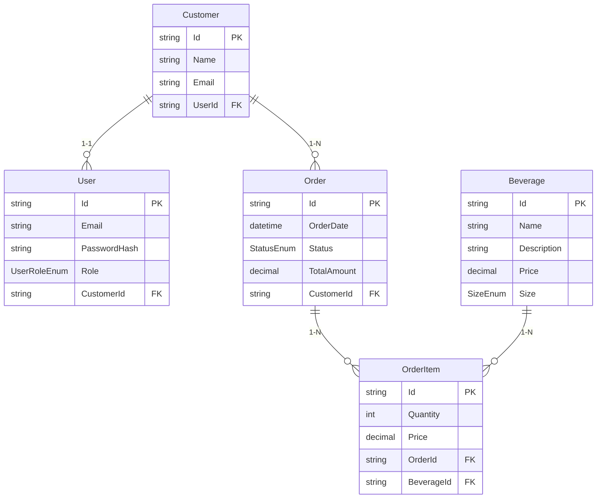
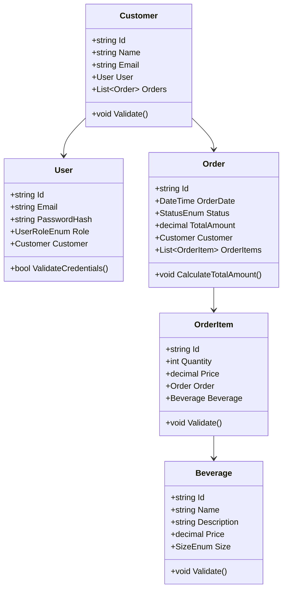

# Brewery API Showcase

This repository is a showcase for the backend for a full-stack B2B Brewery Ordering System. It highlights best practices for designing an API-driven architecture, focusing on clean, maintainable code, efficient data handling, and structured deployment. This document covers the API’s structure, architecture patterns, database design, and other inner workings relevant for future development or learning.

---

## Table of Contents

1. [Project Architecture](#project-architecture)
2. [API Structure](#api-structure)
3. [Database Design](#database-design)
4. [Class Diagrams](#class-diagrams)
5. [Authentication and Security](#authentication-and-security)
6. [Getting Started](#getting-started)
7. [Environment Variables](#environment-variables)
8. [Contact and Contributions](#contact-and-contributions)

---

## Project Architecture

### Overview
This project follows a **RESTful API architecture** using **ASP.NET Core** as the backend and **Entity Framework Core** for database management. The application is structured in a way that ensures separation of concerns, maintainability, and scalability.

### Architectural Layers

1. **Presentation Layer**: Exposes RESTful endpoints that allow clients (i.e., the React front end) to interact with the API, focusing on operations related to customers, orders, and beverages.
2. **Service Layer**: Contains business logic, orchestrating data flow between the API controllers and the database. Key functions, such as order management, analytics, and authentication, are handled here.
3. **Data Access Layer**: Manages interactions with the MySQL database using Entity Framework Core, implementing repository and unit of work patterns to ensure transactional data integrity.

### Design Patterns Used
- **Repository Pattern**: Used to encapsulate data access logic for entities such as `Customer`, `Order`, and `Beverage`.
- **Service Pattern**: The `Service` classes handle complex business logic and reduce controller complexity by orchestrating data flow.

### To be implemented 
- **JWT Authentication**: Used for secure token-based authentication, allowing safe access to protected routes.

## API Structure

### Controllers
The main controllers and their functions:

- **AuthController**: Manages user registration, login, and token generation.
- **CustomersController**: CRUD operations for customers, primarily used by admins.
- **OrdersController**: Allows customers to place orders and admins to view and update order statuses.
- **BeveragesController**: Handles beverage data, allowing admins to manage available products.
- **AnalyticsController**: Provides insights into sales trends, top customers, and product performance.

Each controller is designed to keep methods lightweight, handling only request validation and response formatting, while delegating business logic to the respective service layer.

### Example Request Workflow

1. **Request**: A client sends a request to the `OrdersController` to place a new order.
2. **Service Layer**: The `OrderService` validates the request, calculates total cost, and adds entries in the `Order` and `OrderItems` tables.
3. **Data Layer**: The repository saves data, and any database changes are managed transactionally.

## Database Design

The database is structured using a **code-first approach** with **MySQL**. Relationships among entities are carefully designed to ensure data consistency and efficient querying.

### Entity Relationships

Here’s the ER diagram in **Mermaid** syntax:



### Table Descriptions

- **Customer**: Stores customer details, with a 1-to-1 relationship to `User` and a 1-to-many relationship to `Order`.
- **User**: Manages authentication with role-based access, linking back to `Customer`.
- **Order**: Represents customer orders, each containing multiple `OrderItems`.
- **OrderItem**: Links an order with beverages, capturing quantity and price details.
- **Beverage**: Represents products available for order, with various size and price options.

## Class Diagrams

The main entities and services interact as follows (in Mermaid syntax):



## Authentication and Security

The API uses **JWT (JSON Web Token)** for secure authentication. When a user logs in, the server generates a token that is stored client-side (e.g., in `localStorage`). The token is then attached to subsequent requests to access protected routes, ensuring only authenticated users with valid tokens can perform certain actions.

### JWT Structure
- **Token Generation**: Tokens are issued upon login, with claims that include user roles for role-based access control.
- **Token Validation**: Middleware checks the token’s validity on protected endpoints, decoding the user role and ID.

## Getting Started

### Prerequisites

- **.NET Core SDK**
- **MySQL** (for local development)
- **Azure** (for deployment)

### Running Locally

1. Clone the repository:

   ```bash
   git clone https://github.com/yourusername/brewery-api-showcase.git
   cd brewery-api-showcase
   ```

2. Set up the database using Entity Framework Core migrations:

   ```bash
   dotnet ef database update
   ```

3. Start the API:

   ```bash
   dotnet run
   ```

## Environment Variables

The application requires environment variables for sensitive data. In local development, these should be set in the `.env` file or through Azure’s configuration options for production deployment. Key variables include:

- `JWT_SECRET`: Secret key for JWT token signing
- `DATABASE_URL`: Connection string for the MySQL database

---

## Contact and Contributions

For questions, suggestions, or contributions, please open an issue or contact the repository owner.

--- 

Let me know if you need additional adjustments or specifics!
